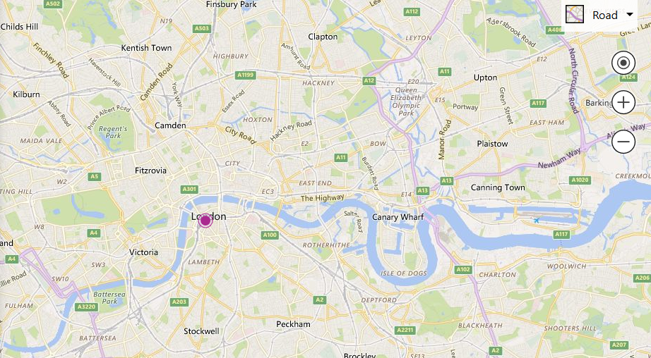

In this tutorial we'll create a site that let's us download data from our API, and draw it on a map. 

Complete this tutorial after completing the Uploader Tutorial.

# Create the site

Similar to our previous demo we need to setup a blank project with parcel.

## Open an empty folder

**Create** and **open** an empty folder.

* Click "Open folder..."
* Create a directory
* Then select `Open it`

## Open VS-Code's in-built Terminal

**Terminal**s are where you can input commands for the system to run. Current modern Web Development uses many tools to product websites, so it's easier to have a terminal always open to command from. **Open** the in-build terminal now.

<Answer>

* In the menu at the top, click View, then select Terminal.s

</Answer>

# Setup the build pipeline

## Install NPM

NPM (otherwise known as the Node Package Manager) is another tool which allows you to easily download and install tools and libraries of code with one line commands. 

**Install** NPM and Node.js on your machine.

<Answer>

Follow the tutorial [here](https://www.npmjs.com/get-npm).

</Answer>

## Install ParcelJs via NPM

ParcelJs is one of the aforementioned tools we'll be using. It takes the code you write, adds a collection of useful functionality for you as a developer, then hosts a server locally for you to view in a browser.

It's highly advised here to **google** "install parceljs" and read their "Getting Started" page for help.

<Answer>

* Run `npm install -g parcel-bundler` in the Terminal.

</Answer>

## Initialise npm project

To keep track of the libraries of code (known as packages in NPM), we need to create a project. Unlike Visual Studio which does this via a fancy GUI, we use another command from npm to do this.

Create a blank project, and accept all the defaults. As before **google** is the answer.

<Answer>

* Run `npm init -y` in the Terminal

</Answer>

## Create new file called `index.js`

Here we're going to create our first script file. These files run code once they're loaded in the user's browser. We're creating a `.js` file, meaning we'll be writing in JavaScript (JS).

Our script is going to do the work of uploading data to the server and responding to user-input, but for now we'll leave it empty.

<Answer>

* Right click on the left-hand panel and select "New File"
* Type `index.js`

</Answer>

## Create new file called `index.html`

While the name doesn't matter exactly, it's good convention to use something like "index" for the starting point of the site.

What does matter is that the ending is `.html` (Hyper-Text Markup Language) given this tells parceljs that this file describes how the website should **look**.

<Answer>

* Right click on the left-hand panel and select "New File"
* Type `index.html`

</Answer>

## Setup starting code in `index.html`

Type into `index.html`. 

HTML is written in XML. XML uses greater-than and less-than characters to define `tags`. Tags must be opened with something like `<example>` and closed with the same name prefixed with a forward-slash `</example>`.

````html
<html>
    <body>
        <script src="./index.js"></script>
    </body>
</html>
````

The tags here work as follows:

* `<html>` means it's the start of an HTML file. This is more a matter of legacy than anything (HTML is very old), but it's important to have.
* `<body>` is where the visible parts of the site start. On larger websites there are a few things before the `<body>` that have other functionality.
* `<script>` is mostly to cheer up parceljs given it requires it. It means the your browser will include that script when you view the website.

## Run ParcelJs

It's time to actually view our website. To do this we're going to use parceljs by running the command in our Terminal. 

* Run `parcel ./index.html` in the Terminal

## Open the site in a browser

If the command worked correctly, it should have outputted an address with `localhost` in it. Open up a good browser (personal preference of course) and visit the address.

<Answer>

* Go to the site http://localhost:1234 in your favourite browser.

</Answer>

# Setup the html for the map

We're going to need to tell the website where to put the map on our webpage.

We can do this by placing a `<div>` element above our script in `index.html`.

```html
<html>
    <body>
        <script src="./index.js"></script>
    </body>
</html>
```vs
<html>
    <body>
        <div id="myMap"></div>
        <script src="./index.js"></script>
    </body>
</html>
```

A `<div>` element is used for spacing, telling the browser to put anything inside of this on it's own line. We're using it as a container for our map.

# Load the map

Setting up the BingMaps requires knowing about a pile of odd bits of javascript, so to make life easier I've put together an NPM package to make this easier.

This let's us concentrate on the application we're trying to make, and less about the legwork.

Replace `index.js` with:

```javascript
// Import some code from NPM
import SimpleBingMap from "simplebingmap"

// Create a map, passing both the element and our apiKey
let map = new SimpleBingMap({
    element: document.getElementById("myMap"),
    apiKey: "AgxkFoRXJFU3KMrXKZ6QreNbHaiYkTbU9oIOTAD2sooe6z6PXaf4jt9LPyeAaWFL"
});

// When the map loads
map.onLoad = () => {

    // Add a point to it
    map.addPoint(51.5032, -0.1223)
}
```

The results should look like this:



# Controlling the map

## Move the dot

Move the dot from **London Waterloo** to **14 Pier Walk**.

<Answer>

```javascript
// Import some code from NPM
import SimpleBingMap from "simplebingmap"

// Create a map, passing both the element and our apiKey
let map = new SimpleBingMap({
    element: document.getElementById("myMap"),
    apiKey: "AgxkFoRXJFU3KMrXKZ6QreNbHaiYkTbU9oIOTAD2sooe6z6PXaf4jt9LPyeAaWFL"
});

// When the map loads
map.onLoad = () => {

    // Add a point to it
    map.addPoint(51.5032, -0.1223)
}
```vs
// Import some code from NPM
import SimpleBingMap from "simplebingmap"

// Create a map, passing both the element and our apiKey
let map = new SimpleBingMap({
    element: document.getElementById("myMap"),
    apiKey: "AgxkFoRXJFU3KMrXKZ6QreNbHaiYkTbU9oIOTAD2sooe6z6PXaf4jt9LPyeAaWFL"
});

// When the map loads
map.onLoad = () => {

    // Add a point to it
    map.addPoint(51.501030, 0.006361)
}
```

</Answer>

## Center the map

Similar to the `addPoint` function, map has a `setCenter` function. Use this to center the map on 14 Pier Walk.

<Answer>

```javascript
// Import some code from NPM
import SimpleBingMap from "simplebingmap"

// Create a map, passing both the element and our apiKey
let map = new SimpleBingMap({
    element: document.getElementById("myMap"),
    apiKey: "AgxkFoRXJFU3KMrXKZ6QreNbHaiYkTbU9oIOTAD2sooe6z6PXaf4jt9LPyeAaWFL"
});

// When the map loads
map.onLoad = () => {

    // Add a point to it
    map.addPoint(51.501030, 0.006361)
}
```vs
// Import some code from NPM
import SimpleBingMap from "simplebingmap"

// Create a map, passing both the element and our apiKey
let map = new SimpleBingMap({
    element: document.getElementById("myMap"),
    apiKey: "AgxkFoRXJFU3KMrXKZ6QreNbHaiYkTbU9oIOTAD2sooe6z6PXaf4jt9LPyeAaWFL"
});

// When the map loads
map.onLoad = () => {

    // Add a point to it
    map.addPoint(51.501030, 0.006361)

    // Center the map
    map.setCenter(51.501030, 0.006361);
}
```

</Answer>

I mean